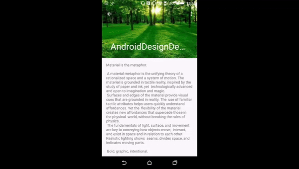

version: 26.1.0
### Demo



[Demo](https://github.com/lliuguangbo/MaterialDesignDemo/blob/master/app/src/main/res/layout/activity_scrolling.xml)


#### CollapsingToolbarLayout构造器

```java
//检查当前的activity是否引用AppCompat的主题
ThemeUtils.checkAppCompatTheme(context);
//文字收缩的帮助类
mCollapsingTextHelper = new CollapsingTextHelper(this);
....
// 保证调用invalidate()时， 该viewgroup的 draw, drawChild的方法能调用
setWillNotDraw(false);

// 设置OnApplyWindowInsetsListener， 用于监听WindowInsets的状态， WindowInsets是指状态栏, 导航栏.
ViewCompat.setOnApplyWindowInsetsListener(this,
        new android.support.v4.view.OnApplyWindowInsetsListener() {
            @Override
            public WindowInsetsCompat onApplyWindowInsets(View v,
                    WindowInsetsCompat insets) {
                // 当前activity的高度 = 手机屏幕 - 状态栏 - 导航栏，突然有代码请求activity的视图嵌入到状态栏或者导航栏里，
                // 这是activity的高度 = 手机屏幕。 这种情况就会触发onWindowInsetChanged
                // onWindowInsetChanged方法的逻辑是：当前insets不一致啦，调用reqeustLayout请求重新布局
                return onWindowInsetChanged(insets);
            }
        });
```   
#### onAttachedToWindow与onDetachedFromWindow
CollapsingToolbarLayout的收缩动画需要他的父类是AppBarLayout
onAttachedToWindow()就做了两件事：1. 获取父别布局AppBarLayout添加OnOffsetChangedListener监听
                                 2. ViewCompat.requestApplyInsets(this) 请求安装WindowInsets
onDetachedFromWindow():移除OnOffsetChangedListener监听
简单讲一下WindowInsets： requestApplyInsets， setOnApplyWindowInsetsListener， setFitsSystemWindows
状态栏只有一个，只能被一个View消耗掉，当调用requestApplyInsets 就会重新分配一次WindowInsets， OnApplyWindowInsetsListener就会被回调
setFitsSystemWindows: 设置了一个标志
```java
final ViewParent parent = getParent();
if (parent instanceof AppBarLayout) {
    // Copy over from the ABL whether we should fit system windows
    ViewCompat.setFitsSystemWindows(this, ViewCompat.getFitsSystemWindows((View) parent));

    if (mOnOffsetChangedListener == null) {
        mOnOffsetChangedListener = new OffsetUpdateListener();
    }
    ((AppBarLayout) parent).addOnOffsetChangedListener(mOnOffsetChangedListener);

    // We're attached, so lets request an inset dispatch
    ViewCompat.requestApplyInsets(this);
}
```

#### CollapsingToolbarLayout.LayoutParams
mCollapseMode:
- COLLAPSE_MODE_OFF           关闭收缩(默认)
- COLLAPSE_MODE_PIN           别针模式
- COLLAPSE_MODE_PARALLAX      视差模式

mParallaxMult: 视差因数 (默认是0.5f)

```java
TypedArray a = c.obtainStyledAttributes(attrs,
                    R.styleable.CollapsingToolbarLayout_Layout);
            mCollapseMode = a.getInt(
                    R.styleable.CollapsingToolbarLayout_Layout_layout_collapseMode,
                    COLLAPSE_MODE_OFF);
            setParallaxMultiplier(a.getFloat(
                    R.styleable.CollapsingToolbarLayout_Layout_layout_collapseParallaxMultiplier,
                    DEFAULT_PARALLAX_MULTIPLIER));
            a.recycle();
```

#### onMeasure
1. ensureToolbar()：寻找子View的里Toolbar,并赋值给mToolbar，找到后会调用updateDummyView(), 当mCollapsingTitleEnabled为true时，这个方法给Toolbar添加一个虚拟的View, 覆盖在Toolbar上面.

寻找Toolbar有两种情况：

- Toolbar是直接子View.
- Toolbar不是直接子View, 这种情况需要使用app:toolbarId或者代码设置, 并会赋值给mToolbar, 而且通过mToolbar的getParent去遍历,给mToolbarDirectChild赋值.(mToolbarDirectChild是CollapsingToolbarLayout的直接子View)


2. topInset > 0 时是需要嵌入到状态栏下的情况，如果高度设置wrap_content， CollapsingToolbarLayout的高度需要增加topInset.


```java
@Override
protected void onMeasure(int widthMeasureSpec, int heightMeasureSpec) {
   ensureToolbar();
   super.onMeasure(widthMeasureSpec, heightMeasureSpec);

   final int mode = MeasureSpec.getMode(heightMeasureSpec);
   final int topInset = mLastInsets != null ? mLastInsets.getSystemWindowInsetTop() : 0;
   if (mode == MeasureSpec.UNSPECIFIED && topInset > 0) {
       // If we have a top inset and we're set to wrap_content height we need to make sure
       // we add the top inset to our height, therefore we re-measure
       heightMeasureSpec = MeasureSpec.makeMeasureSpec(
               getMeasuredHeight() + topInset, MeasureSpec.EXACTLY);
       super.onMeasure(widthMeasureSpec, heightMeasureSpec);
   }
}

private void updateDummyView() {
  if (!mCollapsingTitleEnabled && mDummyView != null) {
      // If we have a dummy view and we have our title disabled, remove it from its parent
      final ViewParent parent = mDummyView.getParent();
      if (parent instanceof ViewGroup) {
          ((ViewGroup) parent).removeView(mDummyView);
      }
  }
  if (mCollapsingTitleEnabled && mToolbar != null) {
      if (mDummyView == null) {
          mDummyView = new View(getContext());
      }
      if (mDummyView.getParent() == null) {
          mToolbar.addView(mDummyView, LayoutParams.MATCH_PARENT, LayoutParams.MATCH_PARENT);
      }
  }
}

```

#### onLayout

1. 当需要嵌入到状态栏下的时，fitsSystemWindows为false的子View向下偏移状态栏的高度。

```java
if (mLastInsets != null) {
    // Shift down any views which are not set to fit system windows
    final int insetTop = mLastInsets.getSystemWindowInsetTop();
    for (int i = 0, z = getChildCount(); i < z; i++) {
        final View child = getChildAt(i);
        if (!ViewCompat.getFitsSystemWindows(child)) {
            if (child.getTop() < insetTop) {
                // If the child isn't set to fit system windows but is drawing within
                // the inset offset it down
                ViewCompat.offsetTopAndBottom(child, insetTop);
            }
        }
    }
}

```

2. mCollapsingTitleEnabled为true时，处理Title的收缩动画，主要是通过mCollapsingTextHelper类来处理

```java
if (mDrawCollapsingTitle) {
    final boolean isRtl = ViewCompat.getLayoutDirection(this)
            == ViewCompat.LAYOUT_DIRECTION_RTL;

    // 获取最大偏移量：这里mToolbarDirectChild判断是处理toolbar是不是直接子View的两种情况
    // 最大偏移量可以简单理解：toolbar的底部到CollapsingToolbarLayout的底部的距离
    final int maxOffset = getMaxOffsetForPinChild(
            mToolbarDirectChild != null ? mToolbarDirectChild : mToolbar);

    //计算收缩和展开的边界, mDummyView的位置刚好toolbar的位置，用于定位置的      
    ViewGroupUtils.getDescendantRect(this, mDummyView, mTmpRect);
    mCollapsingTextHelper.setCollapsedBounds(
            mTmpRect.left + (isRtl
                    ? mToolbar.getTitleMarginEnd()
                    : mToolbar.getTitleMarginStart()),
            mTmpRect.top + maxOffset + mToolbar.getTitleMarginTop(),
            mTmpRect.right + (isRtl
                    ? mToolbar.getTitleMarginStart()
                    : mToolbar.getTitleMarginEnd()),
            mTmpRect.bottom + maxOffset - mToolbar.getTitleMarginBottom());

    // Update the expanded bounds
    mCollapsingTextHelper.setExpandedBounds(
            isRtl ? mExpandedMarginEnd : mExpandedMarginStart,
            mTmpRect.top + mExpandedMarginTop,
            right - left - (isRtl ? mExpandedMarginStart : mExpandedMarginEnd),
            bottom - top - mExpandedMarginBottom);
    // Now recalculate using the new bounds
    mCollapsingTextHelper.recalculate();
}

```
3. 更新子View的位置,根据偏移量上下移动

```java
for (int i = 0, z = getChildCount(); i < z; i++) {
    getViewOffsetHelper(getChildAt(i)).onViewLayout();
}
```
4. 更新mContentScrim和mStatusBarScrim，这下面会简单，调用updateScrimVisibility()更新


#### OnOffsetChangedListener 的onOffsetChanged() - 该类核心方法
```java
@Override
        public void onOffsetChanged(AppBarLayout layout, int verticalOffset) {
            mCurrentOffset = verticalOffset;

            //1. verticalOffset: 向上收缩时，从0 到 负数, 当完全收缩后，负数会维持在一个最小值; 向下展开时，从负数到0。

            final int insetTop = mLastInsets != null ? mLastInsets.getSystemWindowInsetTop() : 0;

            //2. 这里要说明一下，收缩或展开的过程中CollapsingToolbarLayout的高度是没有变化的。收缩或展开的过程本质上是AppBarLayout下向上或向下偏移,verticalOffset就是AppBarLayout的偏移量，AppBarLayout相对原来的位置是向上的，所有verticalOffset一直为负数，要想理解整个联动动画的过程可以需要结合CoordinatorLayout的Behavior, NestedScrollingParent, NestedScrollingChild, AppBarLayout在理解才可以,
            //这里不展开啦，只关注CollapsingToolbarLayout本身

            //下面这个循环的母的是根据collpaseMode来更新子View的偏移量
            // 1. PIN 模式: pin是别针的意思，大概意思就是订在这里不动。收缩时AppBarLayout在向上偏移，要想保证child不动，就需要反方向偏移
            // 2. PARALLAX 模式：视差效果，这个效果原理很简单, AppBarLayout在向上偏移，而child向上的偏移量 -verticalOffset 乘上一个因子, 保证不和AppBarLayout偏移量同步就产生了视差效果
            for (int i = 0, z = getChildCount(); i < z; i++) {
                final View child = getChildAt(i);
                final LayoutParams lp = (LayoutParams) child.getLayoutParams();
                final ViewOffsetHelper offsetHelper = getViewOffsetHelper(child);

                switch (lp.mCollapseMode) {
                    case LayoutParams.COLLAPSE_MODE_PIN:
                        offsetHelper.setTopAndBottomOffset(MathUtils.clamp(
                                -verticalOffset, 0, getMaxOffsetForPinChild(child)));
                        break;
                    case LayoutParams.COLLAPSE_MODE_PARALLAX:
                        offsetHelper.setTopAndBottomOffset(
                                Math.round(-verticalOffset * lp.mParallaxMult));
                        break;
                }
            }


            //更新状态栏和收缩后内容的背景

            // Show or hide the scrims if needed
            updateScrimVisibility();

            if (mStatusBarScrim != null && insetTop > 0) {
                ViewCompat.postInvalidateOnAnimation(CollapsingToolbarLayout.this);
            }


            // 根据verticalOffset偏移量和expandRange展开的范围算出因数,交给mCollapsingTextHelper调整title字体的大小，绘制的边界等参数，mCollapsingTextHelper.setExpansionFraction()里面会调用view重绘制的方法,CollapsingToolbarLayout的onDraw会被调用, 将title绘制画布上

            // Update the collapsing text's fraction
            final int expandRange = getHeight() - ViewCompat.getMinimumHeight(
                    CollapsingToolbarLayout.this) - insetTop;
            mCollapsingTextHelper.setExpansionFraction(
                    Math.abs(verticalOffset) / (float) expandRange);
        }
```

#### updateScrimVisibility()和onDraw()

前面也说到updateScrimVisibility()这个方法是更新状态栏和收缩后内容的背景的
mContentScrim 和 mStatusBarScrim 都是Drawable来的，可以通过app:contentScrim和
app:statusBarScrim来设置。看上面的demo, 我把mContentScrim和mStatusBarScrim都设置为粉红色,你看gif会发现，只有向上收缩到一定层度时粉红色背景才会出现,mStatusBarScrim代表状态栏高度下面的背景,其它部分就是mContentScrim。控制这两个背景出现的时机是通过mScrimVisibleHeightTrigger这个变量，也可以通过app:scrimVisibleHeightTrigger来设置。

看这个方法，当getHeight() + mCurrentOffset < getScrimVisibleHeightTrigger()时才生效，当调用setScrimsShown(true)时,会通过改变mScrimAlpha这个透明度和要求重绘制达到效果

```java
final void updateScrimVisibility() {
    if (mContentScrim != null || mStatusBarScrim != null) {
        setScrimsShown(getHeight() + mCurrentOffset < getScrimVisibleHeightTrigger());
    }
}
```


最后看看onDraw()的实现, 前面已经分析过了，这个方法会分3部分绘制。
1. mContentScrim的绘制
2. 通过mCollapsingTextHelper绘制Toolbar的Title
3. mStatusBarScrim的绘制,只有layout是嵌入到状态栏下才会绘制,通过mLastInsets去判断是否需要绘制

```java
if (mToolbar == null && mContentScrim != null && mScrimAlpha > 0) {
    mContentScrim.mutate().setAlpha(mScrimAlpha);
    mContentScrim.draw(canvas);
}

// Let the collapsing text helper draw its text
if (mCollapsingTitleEnabled && mDrawCollapsingTitle) {
    mCollapsingTextHelper.draw(canvas);
}

// Now draw the status bar scrim
if (mStatusBarScrim != null && mScrimAlpha > 0) {
    final int topInset = mLastInsets != null ? mLastInsets.getSystemWindowInsetTop() : 0;
    if (topInset > 0) {
        mStatusBarScrim.setBounds(0, -mCurrentOffset, getWidth(),
                topInset - mCurrentOffset);
        mStatusBarScrim.mutate().setAlpha(mScrimAlpha);
        mStatusBarScrim.draw(canvas);
    }
}

```
