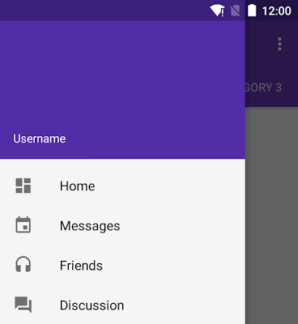
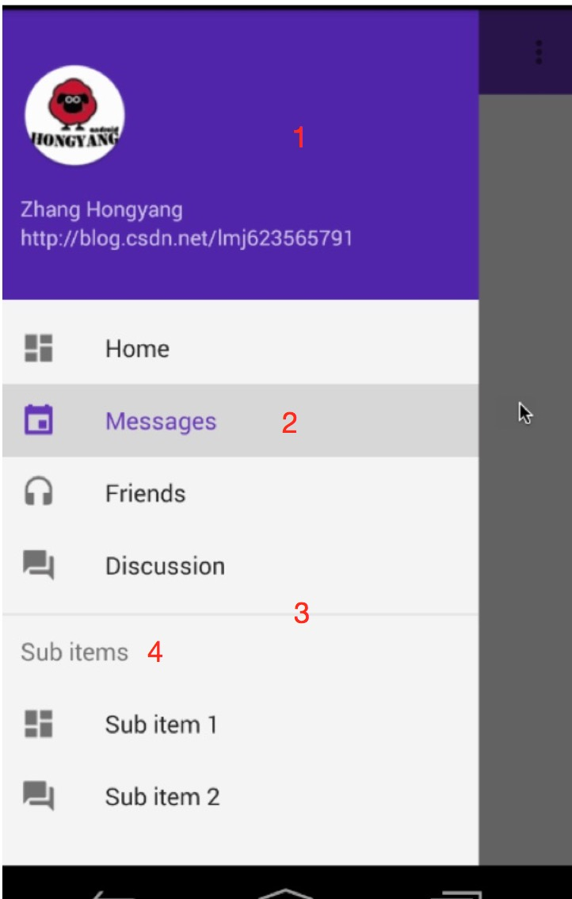
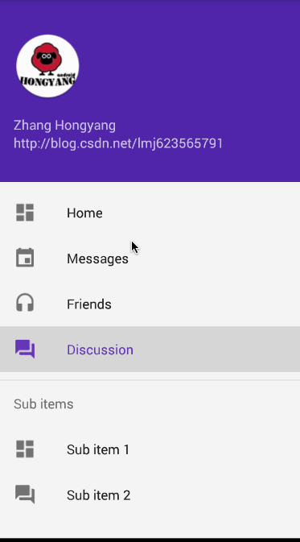

# NavigationView源码解析

>分析版本`com.android.support:design:23.1.0`


## 一、概述

`NavigationView`属于[`android_design_supprot_library`](http://android-developers.blogspot.com/2015/05/android-design-support-library.html)库的控件，主要是为了帮助大家去更加的方便的实现`material design`风格的app。

为了更好去对源码分析就行理解，首先我们这里简单贴一下用法：

其效果一般为：



用法也非常简单，只需要在布局文件中声明即可：

```xml
<android.support.v4.widget.DrawerLayout
    xmlns:android="http://schemas.android.com/apk/res/android"
    xmlns:app="http://schemas.android.com/apk/res-auto"
    android:layout_width="match_parent"
    android:layout_height="match_parent"
    android:fitsSystemWindows="true">

<!-- your content layout -->

<android.support.design.widget.NavigationView
        android:layout_width="wrap_content"
        android:layout_height="match_parent"
        android:layout_gravity="start"
        app:headerLayout="@layout/drawer_header"
        app:menu="@menu/drawer"/>
</android.support.v4.widget.DrawerLayout>
```

其一般和`DrawerLayout`配合使用，作为左侧的菜单布局，这里我们主要关注`NavigationView`的声明。

对应效果图和布局文件的声明，可以看出其布局主要分为header和menu两部分，在布局文件的声明中也可以得到体现，header对应一个布局文库，menu则对应一个菜单的xml文件。

ok，简单回顾完成用法以后，我们在分析源码前，先考虑一下，对于这样的UI效果，如果没有`NavigationView `，我们如何去做，很简单的，我们想到使用：

* ListView去实现`NavigationView `所对应的效果

的确是可以的，header作为addHeaderView，menu则对应item数据项即可。

当然既然能用`ListView`,那么肯定也可以使用`RecyclerView`，是的，为了更好的去理解源码分析，这里需要指出

* 其实NavigationView内部就是通过`RecyclerView `实现的（针对目前分析版本）

在早一点的版本，例如`22.2.0`，其内部是ListView实现的。

## 二、源码分析

###（1）寻找RecyclerView

那么，既然我们已经清楚`NavigationView `内部其实就是`RecyclerView`实现了，那么接下来看源码的过程，就可以有针对有目的的去阅读了。

首先看`NavigationView`的构造方法：

```java
#NavigationView
public class NavigationView extends ScrimInsetsFrameLayout {
    private final NavigationMenu mMenu;
    private final NavigationMenuPresenter mPresenter = new NavigationMenuPresenter();

    private OnNavigationItemSelectedListener mListener;
    private int mMaxWidth;

    private MenuInflater mMenuInflater;

  
    public NavigationView(Context context, AttributeSet attrs, int defStyleAttr) {
        super(context, attrs, defStyleAttr);

        ThemeUtils.checkAppCompatTheme(context);

        // Create the menu
        mMenu = new NavigationMenu(context);

        //省略了获取部分自定义属性的代码
        
        mMenu.setCallback(new MenuBuilder.Callback() {
            @Override
            public boolean onMenuItemSelected(MenuBuilder menu, MenuItem item) {
                return mListener != null && mListener.onNavigationItemSelected(item);
            }

            @Override
            public void onMenuModeChange(MenuBuilder menu) {}
        });
        mPresenter.setId(PRESENTER_NAVIGATION_VIEW_ID);
        mPresenter.initForMenu(context, mMenu);
        mPresenter.setItemIconTintList(itemIconTint);
        if (textAppearanceSet) {
            mPresenter.setItemTextAppearance(textAppearance);
        }
        mPresenter.setItemTextColor(itemTextColor);
        mPresenter.setItemBackground(itemBackground);
        mMenu.addMenuPresenter(mPresenter);
        addView((View) mPresenter.getMenuView(this));

        if (a.hasValue(R.styleable.NavigationView_menu)) {
            inflateMenu(a.getResourceId(R.styleable.NavigationView_menu, 0));
        }

        if (a.hasValue(R.styleable.NavigationView_headerLayout)) {
            inflateHeaderView(a.getResourceId(R.styleable.NavigationView_headerLayout, 0));
        }

        a.recycle();
    }
```

`NavigationView `是继承自FrameLayout的，首先我们看起构造方法，因为我们刚才已经预先说明其内部是`RecyclerView`实现的，那么我们首先定位在哪里加入的`RecyclerView`.

关注到上述代码的39行：

```java
addView((View) mPresenter.getMenuView(this));
```

这里添加了一个view，调用是`mPresenter.getMenuView `，源码更进去，可以看到

```java
#NavigationMenuPresenter
@Override
public MenuView getMenuView(ViewGroup root) {
    if (mMenuView == null) {
        mMenuView = (NavigationMenuView) mLayoutInflater.inflate(
                R.layout.design_navigation_menu, root, false);
        if (mAdapter == null) {
            mAdapter = new NavigationMenuAdapter();
        }
        mHeaderLayout = (LinearLayout) mLayoutInflater
                .inflate(R.layout.design_navigation_item_header,
                        mMenuView, false);
        mMenuView.setAdapter(mAdapter);
    }
    return mMenuView;
}
```

这个方法返回值是`NavigationMenuView `，而这个类实际上继承自`RecyclerView`。除此以外呢，可以看到这里还初始化了`NavigationMenuAdapter `，并且调用了`setAdapter()`；以及初始化了`mHeaderLayout `。顾名思义，adapter肯定是为`RecyclerView `准备的，而`mHeaderLayout `肯定是用于放置我们设置的`app:headerLayout`.

###（2）数据源的初始化

到这里我们已经确定了`NavigationView`是个FrameLayout，其内部放置了一个`RecyclerView`，根据我们的使用情况，并不需要去单独的设置item数据，只需要使用属性`app:menu="@menu/drawer"`，所以，RecylcerView对应的Adapter所需要的数据源，肯定也是在构造方法中获取的。

简单看一眼构造中的代码，找到如下几行：

```java
#NavigationView
if (a.hasValue(R.styleable.NavigationView_menu)) {
    inflateMenu(a.getResourceId(R.styleable.NavigationView_menu, 0));
}

public void inflateMenu(int resId) {
    getMenuInflater().inflate(resId, mMenu);
    mPresenter.updateMenuView(false);
}
```

可以看到呢，对我们的menu读取后，调用的是`getMenuInflater().inflate`，通过该方法呢，会完成对我们资源文件中定义的menuItem读取值mMenu中。读取完成以后呢，调用了`mPresenter.updateMenuView `，该方法会间接的为`Adapter`设置值以及调用`notifyDataSetChanged`，具体代码如下：

```java
#NavigationMenuPresenter
@Override
public void updateMenuView(boolean cleared) {
    if (mAdapter != null) {
        mAdapter.update();
    }
}

#NavigationMenuPresenter.NavigationMenuAdapter
public void update() {
    prepareMenuItems();
    notifyDataSetChanged();
}
```
第一个方法肯定是准备数据，第二个方法通知更新了。对于数据的准备呢，我们需要去了解下，因为`NavigationView`中的item并不是一样的，涉及到多种类型。

```java
#NavigationMenuPresenter.NavigationMenuAdapter
private void prepareMenuItems() {
    
    mItems.clear();
    mItems.add(new NavigationMenuHeaderItem());

    int currentGroupId = -1;
    int currentGroupStart = 0;
    boolean currentGroupHasIcon = false;
    for (int i = 0, totalSize = mMenu.getVisibleItems().size(); i < totalSize; i++) {
        MenuItemImpl item = mMenu.getVisibleItems().get(i);
        //..省略几行代码
        if (item.hasSubMenu()) {
            SubMenu subMenu = item.getSubMenu();
            if (subMenu.hasVisibleItems()) {
                if (i != 0) {
                    mItems.add(new NavigationMenuSeparatorItem(mPaddingSeparator, 0));
                }
                mItems.add(new NavigationMenuTextItem(item));
                boolean subMenuHasIcon = false;
                int subMenuStart = mItems.size();
                for (int j = 0, size = subMenu.size(); j < size; j++) {
                    MenuItemImpl subMenuItem = (MenuItemImpl) subMenu.getItem(j);
                    //..
                    mItems.add(new NavigationMenuTextItem(subMenuItem));
                }
            }
        } else {
            int groupId = item.getGroupId();
            if (groupId != currentGroupId) { // first item in group
                if (i != 0) {
                    currentGroupStart++;
                    mItems.add(new NavigationMenuSeparatorItem(
                            mPaddingSeparator, mPaddingSeparator));
                }
            } 
            mItems.add(new NavigationMenuTextItem(item));
            currentGroupId = groupId;
        }
    }
  }
```
上面代码蛮长的，主要关注什么呢？很明显mItems是Adapter对应的数据源，那么我们关注的应该就是`mItems.add()`方法。

首先加了个`NavigationMenuHeaderItem`，我们都知道RecylerView本身并没有addHeaderView方法，看来对于headLayout也是通过多种item type实现的。


接下来是遍历`mMenu.getVisibleItems()`，那么我们按顺序看代码吧，首先判断的是：


* item.hasSubMenu()

	如果包含subMenu，则调用：
	
	```java
	 mItems.add(new NavigationMenuTextItem(item));
	```
	
	如果当前并非是第一个，则还需要添加一个分隔符（NavigationMenuSeparatorItem）
	
	```java
	mItems.add(new NavigationMenuSeparatorItem(mPaddingSeparator, 0));
	```
	再往下就是遍历所有的subMenu了，也很简单，直接添加`NavigationMenuTextItem`
	
	```java
	 mItems.add(new NavigationMenuTextItem(subMenuItem));
	```

* else分支（即不包含subMenu）	

	首先判断是否是group的第一个item，如果是的话，需要额外添加一个分隔符（`NavigationMenuSeparatorItem`），否则的话直接添加一个`NavigationMenuTextItem`。
	
好了，这样的话，我们就分析完了，可以看到上面呢，一共包含几种MenuItem呢？

* NavigationMenuHeaderItem 对应HeaderLayout
* NavigationMenuTextItem 对应于一般的Item
* NavigationMenuSeparatorItem 对应分隔符

从源码上看只有上述3中，那么我们看一个包含多种menu item的效果图：



简单数一下，怎么好像是4种，恩，其实上图2，4都是`NavigationMenuTextItem `，只不过4中传入的item的`hasSubMenu=true`.

这样的话，我们就分析完成了数据源的初始化。

那么Adapter有了数据源，并且调用了`notifyDataSetChanged`，接下来应该看的代码就是Adapter内部的`onCreateViewHolder和onCreateViewHolder`等代码了。

###（3）NavigationMenuAdapter

因为我们涉及到多个item type，所以重点看三个方法，分别为：`getItemViewType`，`onCreateViewHolder`,`onBindViewHolder`。

* getItemViewType

```java
#NavigationMenuPresenter.NavigationMenuAdapter
@Override
public int getItemViewType(int position) {
    NavigationMenuItem item = mItems.get(position);
    if (item instanceof NavigationMenuSeparatorItem) {
        return VIEW_TYPE_SEPARATOR;
    } else if (item instanceof NavigationMenuHeaderItem) {
        return VIEW_TYPE_HEADER;
    } else if (item instanceof NavigationMenuTextItem) {
        NavigationMenuTextItem textItem = (NavigationMenuTextItem) item;
        if (textItem.getMenuItem().hasSubMenu()) {
            return VIEW_TYPE_SUBHEADER;
        } else {
            return VIEW_TYPE_NORMAL;
        }
    }
    throw new RuntimeException("Unknown item type.");
}
```
根据item的类型去决定ItemViewType，那么我们上面已经进行了详细的分析，一种有3种item类型，其中`NavigationMenuTextItem `分为`hasSubMenu() `为true,false两种情况。刚好对应上述代码。

* onCreateViewHolder

```java
#NavigationMenuPresenter.NavigationMenuAdapter
@Override
public ViewHolder onCreateViewHolder(ViewGroup parent, int viewType) {
    switch (viewType) {
        case VIEW_TYPE_NORMAL:
            return new NormalViewHolder(mLayoutInflater, parent, mOnClickListener);
        case VIEW_TYPE_SUBHEADER:
            return new SubheaderViewHolder(mLayoutInflater, parent);
        case VIEW_TYPE_SEPARATOR:
            return new SeparatorViewHolder(mLayoutInflater, parent);
        case VIEW_TYPE_HEADER:
            return new HeaderViewHolder(mHeaderLayout);
    }
    return null;
}
```

根据不同的itemViewType，返回不同的ViewHolder，每个viewholder也对应一个布局文件，分别为：

* SubheaderViewHolder 对应的布局文件为一个TextView
* SeparatorViewHolder 对应一个FrameLayout，其内部是`height=1dp`的View
* HeaderViewHolder 对应mHeaderLayout，其实就是LinearLayout包裹我们设置的headerLayout
* NormalViewHolder 这个对应于一个`NavigationMenuItemView`


那么大概知道每个itemViewType对应的布局文件之后，就可以看onBindViewHolder了

* onBindViewHolder

```java
@Override
#NavigationMenuPresenter.NavigationMenuAdapter
public void onBindViewHolder(ViewHolder holder, int position) {
    switch (getItemViewType(position)) {
        case VIEW_TYPE_NORMAL: {
            NavigationMenuItemView itemView = (NavigationMenuItemView) holder.itemView;
            itemView.setIconTintList(mIconTintList);
            if (mTextAppearanceSet) {
                itemView.setTextAppearance(itemView.getContext(), mTextAppearance);
            }
            if (mTextColor != null) {
                itemView.setTextColor(mTextColor);
            }
            itemView.setBackgroundDrawable(mItemBackground != null ?
                    mItemBackground.getConstantState().newDrawable() : null);
            NavigationMenuTextItem item = (NavigationMenuTextItem) mItems.get(position);
            itemView.initialize(item.getMenuItem(), 0);
            break;
        }
        case VIEW_TYPE_SUBHEADER: {
            TextView subHeader = (TextView) holder.itemView;
            NavigationMenuTextItem item = (NavigationMenuTextItem) mItems.get(position);
            subHeader.setText(item.getMenuItem().getTitle());
            break;
        }
        case VIEW_TYPE_SEPARATOR: {
            NavigationMenuSeparatorItem item =
                    (NavigationMenuSeparatorItem) mItems.get(position);
            holder.itemView.setPadding(0, item.getPaddingTop(), 0,
                    item.getPaddingBottom());
            break;
        }
        case VIEW_TYPE_HEADER: {
            break;
        }
    }

}
```

恩，这里主要就是为4中itemTypeView所对应的item进行控件的赋值了，从简单到难来看：

* `VIEW_TYPE_HEADER` 什么都不管，只要把我们设置的headerLayout显示即可
* `VIEW_TYPE_SEPARATOR`首先拿到`NavigationMenuSeparatorItem `，主要是为了拿到padding的值，然后调用`holder.itemView`设置上下的padding，这个padding默认值为8dp。
* `VIEW_TYPE_SUBHEADER`拿到TextView设置下title即可。
* `VIEW_TYPE_NORMAL `

最后这个呢，对应`NavigationMenuItemView`，通过它呢去设置字体，图标，字体颜色，图标颜色，以及根据`item.getMenuItem`设置各种状态。

那么到这里呢，我们就学习完成了`NavigationMenuAdapter `它的内部的处理，那么我们的`NavigationView`已经能够正常的显示了。

显示完了之后，还有个问题，`NavigationView`的Item是可以点击了，如果大家有印象的话，`RecyclerView`自身是没有提供Item点击的回调的，那么`NavigationView`是如何做的。

###（3）Item点击[onNavigationItemSelected]

对于接受Item点击，只有`VIEW_TYPE_NORMAL`的itemViewType才可以，那么我们回顾下`onCreateViewHolder `方法

```java
#NavigationMenuPresenter.NavigationMenuAdapter
public ViewHolder onCreateViewHolder(ViewGroup parent, int viewType) {
    switch (viewType) {
        case VIEW_TYPE_NORMAL:
            return new NormalViewHolder(mLayoutInflater, parent, mOnClickListener);
	//...
	return null ; 
}
```
注意当为`VIEW_TYPE_NORMAL `的时候创建的ViewHolder传入了一个`mOnClickListener `.

```java
#NavigationMenuPresenter.NavigationMenuAdapter
private static class NormalViewHolder extends ViewHolder {

    public NormalViewHolder(LayoutInflater inflater, ViewGroup parent,
            View.OnClickListener listener) {
        super(inflater.inflate(R.layout.design_navigation_item, parent, false));
        itemView.setOnClickListener(listener);
    }

}
```

可以看到，直接调用了`itemView.setOnClickListener `。那么我们看下这个listener

```java
#NavigationMenuPresenter
private final View.OnClickListener mOnClickListener = new View.OnClickListener() {

    @Override
    public void onClick(View v) {
        NavigationMenuItemView itemView = (NavigationMenuItemView) v;
              MenuItemImpl item = itemView.getItemData();
        boolean result = mMenu.performItemAction(item, NavigationMenuPresenter.this, 0);
        if (item != null && item.isCheckable() && result) {
            mAdapter.setCheckedItem(item);
        }
        updateMenuView(false);
    }
};
```

代码不多，经过扫描，应该关注`mMenu.performItemAction`方法：

```java
#MenuBuilder
 public boolean performItemAction(MenuItem item, MenuPresenter preferredPresenter, int flags) {
    MenuItemImpl itemImpl = (MenuItemImpl) item;
    //省略了一些代码
    boolean invoked = itemImpl.invoke();
    return invoked;
}
```
继续跟进去

```java
#MenuItemImpl
public boolean invoke() {
    //省略了一些代码
    if (mMenu.dispatchMenuItemSelected(mMenu.getRootMenu(), this)) {
      return true;
    }
    return false;
}
```

那么主要是`mMenu.dispatchMenuItemSelected `了

```java
#MenuBuilder
boolean dispatchMenuItemSelected(MenuBuilder menu, MenuItem item) {
    return mCallback != null && mCallback.onMenuItemSelected(menu, item);
}
```
终于看到mCallback了，回顾下，在onCreateViewHolder的时候，给我们的itemView添加了clicklistener,当我们点击的时候会辗转调用至`mCallback.onMenuItemSelected(menu, item);`。

而这个`mCallback`正是在`NavigationView`构造方法中设置的。

```java
#NavigationView
mMenu.setCallback(new MenuBuilder.Callback() {
    @Override
    public boolean onMenuItemSelected(MenuBuilder menu, MenuItem item) {
        return mListener != null && mListener.onNavigationItemSelected(item);
    }

    @Override
    public void onMenuModeChange(MenuBuilder menu) {}
});
```

ok，到这我们就理清楚了onMenuItemSelected的回调。

还有个问题，当我们点击的时候，如果添加监听，并且在`onMenuItemSelected `直接`return true`，我们的选中的Item会被高亮显示。

这个其实也在刚才的`mOnClickListener `里面


```java
private final View.OnClickListener mOnClickListener = new View.OnClickListener() {

    @Override
    public void onClick(View v) {
        NavigationMenuItemView itemView = (NavigationMenuItemView) v;
              MenuItemImpl item = itemView.getItemData();
        boolean result = mMenu.performItemAction(item, NavigationMenuPresenter.this, 0);
        if (item != null && item.isCheckable() && result) {
            mAdapter.setCheckedItem(item);
        }
        updateMenuView(false);
    }
};
```

当我们回调返回true，也就意味着`result = true`，那么正常情况下(`checkable=true`)会调用` mAdapter.setCheckedItem(item);`

```java
#NavigationMenuAdapter
public void setCheckedItem(MenuItemImpl checkedItem) {
    if (mCheckedItem == checkedItem || !checkedItem.isCheckable()) {
        return;
    }
    if (mCheckedItem != null) {
        mCheckedItem.setChecked(false);
    }
    mCheckedItem = checkedItem;
    checkedItem.setChecked(true);
}
```
在这里的对上一次选择的item调用了`setChecked(false);`对本次的选中的item调用了`setChecked(true);`从而得到状态切换的效果。

如下图：



ps:早起的版本中，对于`setCheckedItem `的操作，是需要我们自行处理的，建议对于desgin库，尽可能使用最新的版本。

到这里，我们的整个分析就结束了，整个分析从寻找RecylerView，数据源的初始化与设置，Item点击的设置3个点进行展开，源码并不复杂，希望大家可以通过本文加深对`NavigationView`的理解，从而进一步加深对`RecyclerView`用法的理解。
