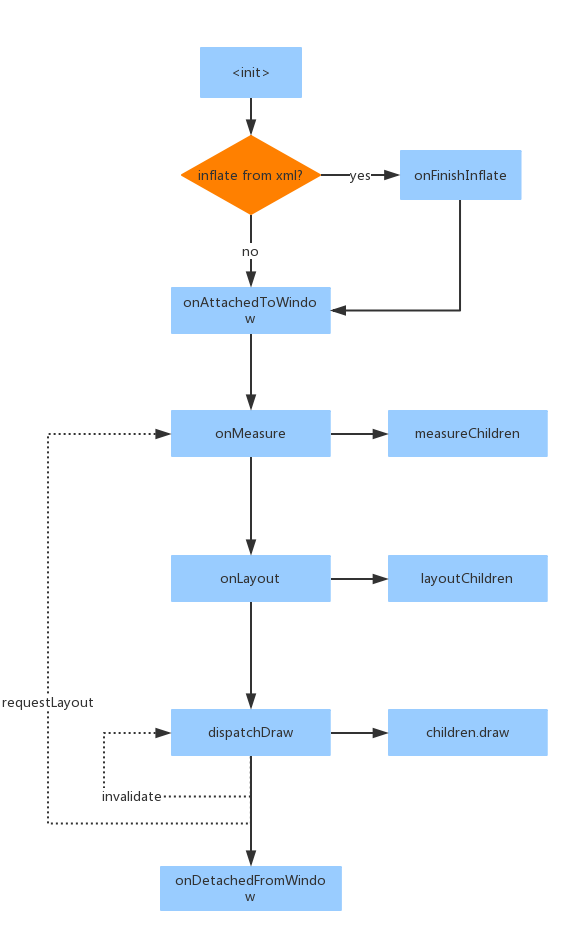
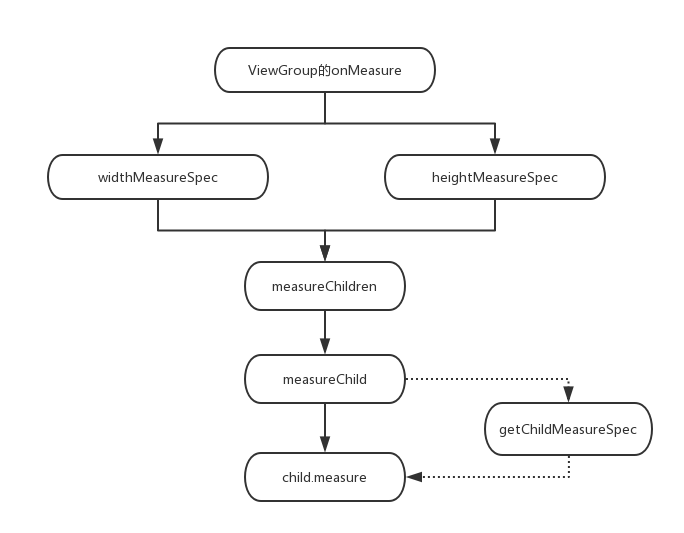
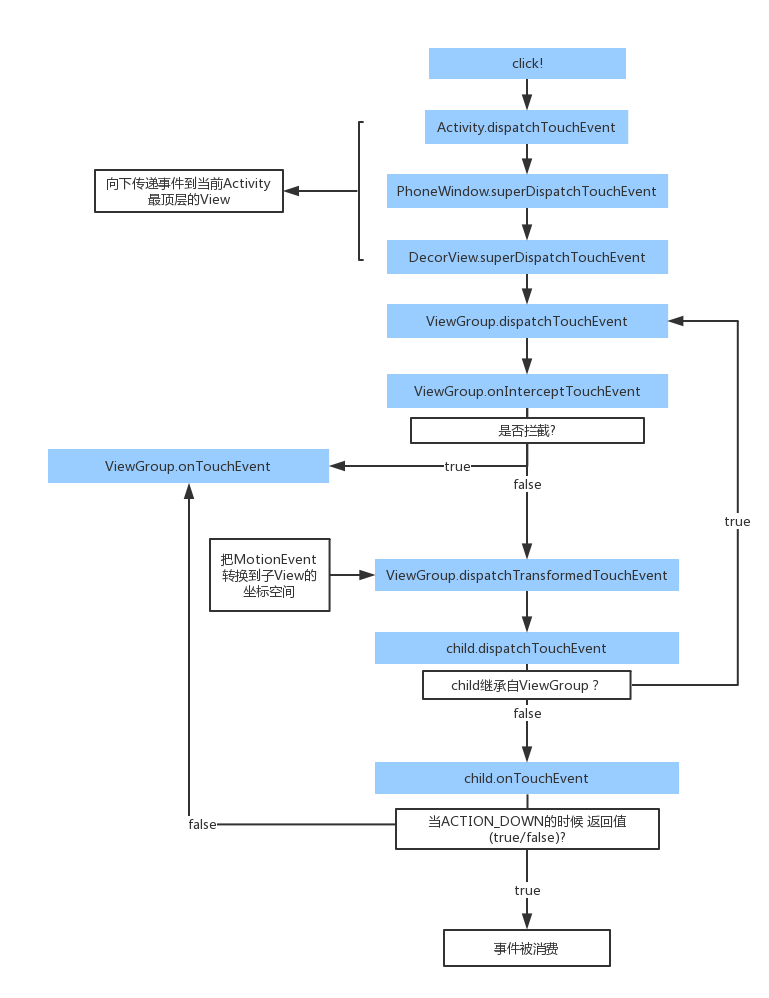

# ViewGroup 源码解析

ViewGroup应该算是日常Android开发中最常涉及到，但是也最少直接使用到的View子类。我们平时所谈论的触摸事件的传递、测量和布局的过程等，其实都源自ViewGroup。同时也是各种其他事件，比如onAttachedToWindow、onDetacheFromWindow、onConfigurationChanged等的中间人。


## ViewGroup生命周期



可以看到ViewGroup也是和View一样在onAttachedToWindow以后，经理测量(onMeasure)、布局(onLayout)、然后才是绘制(ViewGroup默认不绘制自身，而是调用dispatchDraw来绘制子View)。和View不同的是，这每一步都需要对子View进行相同的操作。


#### 测量和布局过程

ViewGroup由于需要兼顾子View的测量和布局，以及在部分情况下子View的测量反过来影响ViewGroup的测量(例如ViewGroup的宽高为WRAP_CONTENT的时候)，整体的测量和布局需要经历比较复杂的过程。


首先从onMeasure方法开始，onMeasure传入了两个作为测量依据的参数,widthMeasureSpec, heightMeasureSpec。这两个参数表面上是int，但实际上是测量模式和父View要求的尺寸两个值组成的。这个int值的最高两位被用来储存测量模式，剩下的30位才是尺寸。测量模式有以下三种：

* UNSPECIFIED 父View并没有强制要求当前ViewGroup遵从某个规范，当前ViewGroup可以是任何尺寸
* EXACTLY 父View要求当前ViewGroup的宽度或者高度必须等于MeasureSpec传入的尺寸
* AT_MOST 父View要求当前ViewGroup的宽度或者高度不能超过MeasureSpec传入的尺寸

然后ViewGroup根据传入的MeasureSpec以及自身对子View的排版规则对子View进行测量，在对子View的测量中又涉及到另一个类：LayoutParams。这个类相信大家都不陌生，不同的布局控件（RelativeLayout、LinearLayout、FrameLayout等)都有自己的一个LayoutParams。里面包含了针对当前布局的一些参数，这些参数影响了ViewGroup对子View的测量。


LayoutParams和MeasureSpec是比较容易搞混的，两个都是和测量布局有关的参数，每个控件都有针对于父View的LayoutParams成员变量，但父View对自身进行测量的时候又要传入MeasureSpec。这两个参数的区别是什么呢？可以简单地理解为：LayoutParams是View自己对自己的布局要求，而MeasureSpec是父View参考了View的LayoutParams后，提出来的对View的布局要求。这就像孩子吵着要跟父母拿钱买十颗糖吃（LayoutParams），父母经过深思熟虑后，决定只给孩子买五颗糖（MeasureSpec）。


ViewGroup内部并没有真正处理子View的测量，因为ViewGroup本身并没有针对子View的规则限制。只有在具体的布局中，比如RelativeLayout、LinearLayout，由于有子View的排版规则才会对子View进行测量。但是ViewGroup本身提供了默认的测量子View的方法：

* measureChildren 根据ViewGroup自身onMeasure传入的MeasureSpec对所有子View进行测量，实际是遍历子View并调用了measureChild方法:

   ```java
   protected void measureChildren(int widthMeasureSpec, int heightMeasureSpec) {
          final int size = mChildrenCount;
          final View[] children = mChildren;
    		// 遍历子View
          for (int i = 0; i < size; ++i) {
              final View child = children[i];
            	// 检测当前子View的Visibility状态，如果是GONE则跳过
              if ((child.mViewFlags & VISIBILITY_MASK) != GONE) {
                  measureChild(child, widthMeasureSpec, heightMeasureSpec);
              }
          }
      }
   ```

  ​

* measureChild 根据ViewGroup自身onMeasure传入的MeasureSpec对某一个子View进行测量

  ```java
  protected void measureChild(View child, int parentWidthMeasureSpec,
              int parentHeightMeasureSpec) {
    		// 获取子View的LayoutParams
          final LayoutParams lp = child.getLayoutParams();

   		// 计算并返回子View的widthMeasureSpec
          final int childWidthMeasureSpec = getChildMeasureSpec(parentWidthMeasureSpec,
                  mPaddingLeft + mPaddingRight, lp.width);
    		// 计算并返回子View的heightMeasureSpec
          final int childHeightMeasureSpec = getChildMeasureSpec(parentHeightMeasureSpec,
                  mPaddingTop + mPaddingBottom, lp.height);

    		// 调用子View的measure方法，measure方法最终会调用子View的onMeasure，具体的实现在View内
          child.measure(childWidthMeasureSpec, childHeightMeasureSpec);
      }
  ```

  ​

这里面实际核心的是getChildMeasureSpec方法，这是一个ViewGroup提供的根据ViewGroup自身的MeasureSpec，ViewGroup的padding以及子View的LayoutParams的width/height返回子View的MeasureSpec的方法：

```java
public static int getChildMeasureSpec(int spec, int padding, int childDimension) {
  		// 用MeasureSpec提供的方法来获取具体的模式和尺寸
  		// (实际上是把高2位和低30位分开, mode = spec & 0xC0000000, size = spec & 0x3FFFFFFF)
        int specMode = MeasureSpec.getMode(spec);
        int specSize = MeasureSpec.getSize(spec);

  		// 由于上一步获取的是ViewGroup自身的specSize，
  		// 而ViewGroup留给子View的区域是要扣除padding的，这边需要减去padding
        int size = Math.max(0, specSize - padding);

        int resultSize = 0;
        int resultMode = 0;

        switch (specMode) {
        // ViewGroup自身的MeasureSpec为EXACTLY的时候
        case MeasureSpec.EXACTLY:
            if (childDimension >= 0) {
              // 子View的LayoutParams传入的尺寸既不是MATCH_PARENT也不是WRAP_CONTENT的时候，
              // 直接让子View的尺寸固定为传入的值
                resultSize = childDimension;
                resultMode = MeasureSpec.EXACTLY;
            } else if (childDimension == LayoutParams.MATCH_PARENT) {
                // 子View的LayoutParams传入的为MATCH_PARENT，即是和父View同样尺寸，
              	// 直接给ViewGroup的size值
                resultSize = size;
                resultMode = MeasureSpec.EXACTLY;
            } else if (childDimension == LayoutParams.WRAP_CONTENT) {
                // 子View的LayoutParams传入的为WRAP_CONTENT，但是ViewGroup自身是固定的尺寸，
              	// 这时候让子View在不超出ViewGroup的size的情况下自行决定大小
                resultSize = size;
                resultMode = MeasureSpec.AT_MOST;
            }
            break;

        // 传入的ViewGroup的MeasureSpec规定在给定的尺寸范围内自行决定大小，
        // 这通常是在ViewGroup本身的尺寸设置为WRAP_CONTENT的情况下传入
        // (参考上面MeasureSpec.EXACTLY的case里面childDimension == LayoutParams.WRAP_CONTNET的情况)
        case MeasureSpec.AT_MOST:
            if (childDimension >= 0) {
                //子View的LayoutParams传入的尺寸既不是MATCH_PARENT也不是WRAP_CONTENT的时候，
                //直接让子View的尺寸固定为传入的值
                resultSize = childDimension;
                resultMode = MeasureSpec.EXACTLY;
            } else if (childDimension == LayoutParams.MATCH_PARENT) {
                // 子View的LayoutParams传入的为MATCH_PARENT，但是ViewGroup自身的尺寸还未确定，
              	//只能让子View在ViewGroup的size范围内自行决定大小
                resultSize = size;
                resultMode = MeasureSpec.AT_MOST;
            } else if (childDimension == LayoutParams.WRAP_CONTENT) {
                // 子View的LayoutParams传入的为WRAP_CONTENT，
                // 这时候让子View在不超出ViewGroup的size的情况下自行决定大小
                resultSize = size;
                resultMode = MeasureSpec.AT_MOST;
            }
            break;

        case MeasureSpec.UNSPECIFIED:
            if (childDimension >= 0) {
                //子View的LayoutParams传入的尺寸既不是MATCH_PARENT也不是WRAP_CONTENT的时候，
                //直接让子View的尺寸固定为传入的值
                resultSize = childDimension;
                resultMode = MeasureSpec.EXACTLY;
            } else if (childDimension == LayoutParams.MATCH_PARENT) {
                // 在ViewGroup自身的MeasureSpec未定义的情况下(UNSPECIFIED)，
                // 给子View也传未定义mode(这边sUseZeroUnspecifiedMeasureSpec)
                resultSize = View.sUseZeroUnspecifiedMeasureSpec ? 0 : size;
                resultMode = MeasureSpec.UNSPECIFIED;
            } else if (childDimension == LayoutParams.WRAP_CONTENT) {
                resultSize = View.sUseZeroUnspecifiedMeasureSpec ? 0 : size;
                resultMode = MeasureSpec.UNSPECIFIED;
            }
            break;
        }
        // 用MeasureSpec类的makeMeasureSpec把size和mode拼装成一个int并返回
        return MeasureSpec.makeMeasureSpec(resultSize, resultMode);
    }
```





当然这只是ViewGroup提供的默认的方法，并不是强制的要求以这个规则返回子View的MeasureSpec。一些布局控件例如RelativeLayout会使用自己的子View的MeasureSpec生成规则。根据子View的LayoutParams来生成MeasureSpec，并对子View进行测量后，ViewGroup(继承自ViewGroup的类)就可以进行布局了。(布局对应的方法onLayout是一个抽象方法，在不同的ViewGroup的子类中有不一样的实现)


### 子View的添加和删除


ViewGroup添加子View的方法有多个，但是最终都会调addView(child, index, params)方法，并在这个方法内调用私有方法addViewInner来实现的。


我们前面知道了每个子View都需要有一个LayoutParams来告诉ViewGroup它布局的时候需要的一些参数，而当添加View的时候，View没有LayoutParams，或者我们调用了没有LayoutParams作为形参的addView方法的时候，ViewGroup会调用自身的generatedDefaultLayoutParams来帮子View生成一个默认的LayoutParams：

```java
public void addView(View child, int index) {
        if (child == null) {
            throw new IllegalArgumentException("Cannot add a null child view to a ViewGroup");
        }
        LayoutParams params = child.getLayoutParams();
        if (params == null) {
            // params为空的情况，调用generateDefaultLayoutParams方法生成LayoutParams
            params = generateDefaultLayoutParams();
            if (params == null) {
                throw new IllegalArgumentException("generateDefaultLayoutParams() cannot return null");
            }
        }
        addView(child, index, params);
    }

public void addView(View child, int width, int height) {
        // 调用这个方法的时候，会直接无视子View原来的LayoutParams，
  		// 直接调用generateDefaultLayoutParams生成新的LayoutParams
        final LayoutParams params = generateDefaultLayoutParams();
        params.width = width;
        params.height = height;
        addView(child, -1, params);
    }
```


然后是私有方法addViewInner：

```java
private void addViewInner(View child, int index, LayoutParams params,
            boolean preventRequestLayout) {
         ...

        // 子View的parent不为空，说明子View已经被添加到其他ViewGroup了。直接抛出异常。
        // 也就是说子View是不允许同时被添加到多个ViewGroup中的。这边挺好理解的，因为子View的布局相关参数都是唯一的，
        // 如果同时被添加到多个ViewGroup，而ViewGroup的布局规则各不相同，会导致我们从某一个ViewGroup获取子View的时候，没法得到它正确的尺寸等相关信息
        if (child.getParent() != null) {
            throw new IllegalStateException("The specified child already has a parent. " +
                    "You must call removeView() on the child's parent first.");
        }

        // 调用checkLayoutParams判断当前的params是不是我们需要的LayoutParams，
  		// 很多继承自ViewGroup的布局都会用自己的LayoutParams，并有独立的一些布局属性。
  		// 如果不是当前布局所需的LayoutParams则调用generateLayoutParams来转换
        if (!checkLayoutParams(params)) {
            params = generateLayoutParams(params);
        }

        // 给子View设置LayoutParams
        if (preventRequestLayout) {
            child.mLayoutParams = params;
        } else {
            child.setLayoutParams(params);
        }

        if (index < 0) {
            index = mChildrenCount;
        }

        // 添加到子View的数组中
        addInArray(child, index);

        // 给子View设置parent
        if (preventRequestLayout) {
            child.assignParent(this);
        } else {
            child.mParent = this;
        }

        // 判断并设置焦点
        if (child.hasFocus()) {
            requestChildFocus(child, child.findFocus());
        }

        // 判断AttachInfo是否为空，AttachInfo不为空说明当前的ViewGroup是已经添加到Window上了。
  		// 调用子View的dispatchAttachedToWindow。通知当前子View已经被添加到Window
        AttachInfo ai = mAttachInfo;
        if (ai != null && (mGroupFlags & FLAG_PREVENT_DISPATCH_ATTACHED_TO_WINDOW) == 0) {
            boolean lastKeepOn = ai.mKeepScreenOn;
            ai.mKeepScreenOn = false;
            child.dispatchAttachedToWindow(mAttachInfo, (mViewFlags&VISIBILITY_MASK));
            if (ai.mKeepScreenOn) {
                needGlobalAttributesUpdate(true);
            }
            ai.mKeepScreenOn = lastKeepOn;
        }

        if (child.isLayoutDirectionInherited()) {
            child.resetRtlProperties();
        }

        dispatchViewAdded(child);
  
        // 判断是否需要通知子View状态改变(state这边指按下、放开、选中等状态)
        if ((child.mViewFlags & DUPLICATE_PARENT_STATE) == DUPLICATE_PARENT_STATE) {
            mGroupFlags |= FLAG_NOTIFY_CHILDREN_ON_DRAWABLE_STATE_CHANGE;
        }

        ...
    }
```


子View的移除则是最终调用了私有方法removeViewInternal：


```java
private void removeViewInternal(int index, View view) {
        if (mTransition != null) {
            mTransition.removeChild(this, view);
        }

        boolean clearChildFocus = false;
  
        // 判断并清除焦点
        if (view == mFocused) {
            view.unFocus(null);
            clearChildFocus = true;
        }

        view.clearAccessibilityFocus();

        // 取消相关的事件Target
        cancelTouchTarget(view);
        cancelHoverTarget(view);

        // 当子View自身还有动画没有结束的时候，把子View添加到disappearingChildren列表中，
  		// 在disappearingChildren列表中的子View会在动画结束后被移除
        if (view.getAnimation() != null ||
                (mTransitioningViews != null && mTransitioningViews.contains(view))) {
            addDisappearingView(view);
        } else if (view.mAttachInfo != null) {
          // 子View自身没有动画在执行中，通知子View从Window中脱离
           view.dispatchDetachedFromWindow();
        }

        if (view.hasTransientState()) {
            childHasTransientStateChanged(view, false);
        }

        needGlobalAttributesUpdate(false);

        // 把子View移出子View数组
        removeFromArray(index);

        if (clearChildFocus) {
            clearChildFocus(view);
            if (!rootViewRequestFocus()) {
                notifyGlobalFocusCleared(this);
            }
        }

        dispatchViewRemoved(view);

        if (view.getVisibility() != View.GONE) {
            notifySubtreeAccessibilityStateChangedIfNeeded();
        }

        ...
    }
```


### 绘制

ViewGroup在默认的情况下自身并不绘制内容，而是调用dispatchDraw方法来安排子View绘制自身，我们来看看这个方法具体做了什么：


```java
protected void dispatchDraw(Canvas canvas) {
        boolean usingRenderNodeProperties = canvas.isRecordingFor(mRenderNode);
        final int childrenCount = mChildrenCount;
        final View[] children = mChildren;
        int flags = mGroupFlags;

        // 检测是否有布局动画
        if ((flags & FLAG_RUN_ANIMATION) != 0 && canAnimate()) {
            final boolean buildCache = !isHardwareAccelerated();
          
            // 给所有当前可见的子View绑定布局动画
            for (int i = 0; i < childrenCount; i++) {
                final View child = children[i];
                if ((child.mViewFlags & VISIBILITY_MASK) == VISIBLE) {
                    final LayoutParams params = child.getLayoutParams();
                    attachLayoutAnimationParameters(child, params, i, childrenCount);
                    bindLayoutAnimation(child);
                }
            }

            final LayoutAnimationController controller = mLayoutAnimationController;
            if (controller.willOverlap()) {
                mGroupFlags |= FLAG_OPTIMIZE_INVALIDATE;
            }

            // 启动布局动画
            controller.start();

            mGroupFlags &= ~FLAG_RUN_ANIMATION;
            mGroupFlags &= ~FLAG_ANIMATION_DONE;

            if (mAnimationListener != null) {
                mAnimationListener.onAnimationStart(controller.getAnimation());
            }
        }

        // 处理clipToPadding的情况，这边是直接调用canvas的clipRect方法来剪切出除去padding的区域
        int clipSaveCount = 0;
        final boolean clipToPadding = (flags & CLIP_TO_PADDING_MASK) == CLIP_TO_PADDING_MASK;
        if (clipToPadding) {
            clipSaveCount = canvas.save();
            canvas.clipRect(mScrollX + mPaddingLeft, mScrollY + mPaddingTop,
                    mScrollX + mRight - mLeft - mPaddingRight,
                    mScrollY + mBottom - mTop - mPaddingBottom);
        }

        ...
          
        for (int i = 0; i < childrenCount; i++) {
            ...

            final int childIndex = getAndVerifyPreorderedIndex(childrenCount, i, customOrder);
            final View child = getAndVerifyPreorderedView(preorderedList, children, childIndex);
            if ((child.mViewFlags & VISIBILITY_MASK) == VISIBLE || child.getAnimation() != null) {
                // 子View是可见状态或者子View的动画还在运行的时候，调用drawChild来绘制子View，
              	// drawChild方法内部则是直接调用子View的draw(canvas, parent, draingTime)方法让子View对自身进行绘制
                more |= drawChild(canvas, child, drawingTime);
            }
        }
        ...
        if (preorderedList != null) preorderedList.clear();

        // 绘制那些即将消失的View，
  		// 所有被移除或者Visibility不是VISIBLE但是自身还有动画没有完成的子View，
  		// 都会被添加到mDisappearingChildren里面，等动画完成后才被移除。
        if (mDisappearingChildren != null) {
            final ArrayList<View> disappearingChildren = mDisappearingChildren;
            final int disappearingCount = disappearingChildren.size() - 1;
            for (int i = disappearingCount; i >= 0; i--) {
                final View child = disappearingChildren.get(i);
                more |= drawChild(canvas, child, drawingTime);
            }
        }
        if (usingRenderNodeProperties) canvas.insertInorderBarrier();

        // 绘制界面边界(开发者选项中开启显示边界后，实际处理相关的边界绘制的即是在这边)
        if (debugDraw()) {
            onDebugDraw(canvas);
        }

        if (clipToPadding) {
            canvas.restoreToCount(clipSaveCount);
        }

        flags = mGroupFlags;

        if ((flags & FLAG_INVALIDATE_REQUIRED) == FLAG_INVALIDATE_REQUIRED) {
            invalidate(true);
        }

        if ((flags & FLAG_ANIMATION_DONE) == 0 && (flags & FLAG_NOTIFY_ANIMATION_LISTENER) == 0 &&
                mLayoutAnimationController.isDone() && !more) {
            mGroupFlags |= FLAG_NOTIFY_ANIMATION_LISTENER;
            final Runnable end = new Runnable() {
               @Override
               public void run() {
                   notifyAnimationListener();
               }
            };
            post(end);
        }
    }
```


dispatchDraw方法里面做的事情还是比较简单的，如果有布局动画则把布局动画绑定到子View上，然后接着便进行子View的绘制。而绑定到子View上的布局动画或者子View自身设置的动画以及View自身的绘制区域裁剪(这边比较让人想不通的是android的clipChildren，也就是对子View绘制区域裁剪是在ViewGroup中统一设置的，一个ViewGroup下的所有子View只能同时处于裁剪或者不裁剪的状态，但是具体执行却是在子View中。应该设置成类似iOS的UIView，每个子View都能控制自己是否被裁剪会比较合理)，都是在子View的draw(canvas, parent, drawingTime)方法里面进行的。


## 事件


### 触摸事件

Android的触摸事件是Android开发进阶必须了解的机制以及面试中必问的问题之一。涉及的方法有dispatchTouchEvent、onInterceptTouchEvent、onTouchEvent。而这一整套机制的真正实现，便是在ViewGroup的dispatchTouchEvent内部。下面是简化后的触摸事件流程图：




触摸事件发生后，在Activity内最先接收到事件的是Activity自身的dispatchTouchEvent，然后Activity传递给Activity的Window。接着Window传递给最顶端的View，也就是DecorView。接下来才是我们熟悉的触摸事件流程：首先是最顶端的ViewGroup(这边便是DecorView)的dispatchTouchEvent接收到事件。并通过onInterceptTouchEvent判断是否需要拦截。如果拦截则分配到ViewGroup自身的onTouchEvent，如果不拦截则查找位于点击区域的子View(当事件是ACTION_DOWN的时候，会做一次查找并根据查找到的子View设定一个TouchTarget，有了TouchTarget以后，后续的对应id的事件如果不被拦截都会分发给这一个TouchTarget)。查找到子View以后则调用dispatchTransformedTouchEvent把MotionEvent的坐标转换到子View的坐标空间，这不仅仅是x，y的偏移，还包括根据子View自身矩阵的逆矩阵对坐标进行变换(这就是使用setTranslationX,setScaleX等方法调用后，子View的点击区域还能保持和自身绘制内容一致的原因。使用Animation做变换点击区域不同步是因为Animation使用的是Canvas的矩阵而不是View自身的矩阵来做变换)。


下面我们来看一下ViewGroup的dispatchTouchEvent方法的源码：


```java
public boolean dispatchTouchEvent(MotionEvent ev) {
        ...

        boolean handled = false;
        if (onFilterTouchEventForSecurity(ev)) {
            final int action = ev.getAction();
            final int actionMasked = action & MotionEvent.ACTION_MASK;

            if (actionMasked == MotionEvent.ACTION_DOWN) {
                // 触摸事件流开始，重置触摸相关的状态
                cancelAndClearTouchTargets(ev);
                resetTouchState();
            }

            // 检测当前是否需要拦截事件。
            final boolean intercepted;
            if (actionMasked == MotionEvent.ACTION_DOWN
                    || mFirstTouchTarget != null) {
              
                // 处理调用requestDisallowInterceptTouchEvent来防止ViewGroup拦截事件的情况
                final boolean disallowIntercept = (mGroupFlags & FLAG_DISALLOW_INTERCEPT) != 0;
                if (!disallowIntercept) {
                    intercepted = onInterceptTouchEvent(ev);
                    ev.setAction(action); 
                } else {
                    intercepted = false;
                }
            } else {
                // 当前没有TouchTarget也不是事件流的起始的话，则直接默认拦截，不通过onInterceptTouchEvent判断。
                intercepted = true;
            }

            final boolean canceled = resetCancelNextUpFlag(this)
                    || actionMasked == MotionEvent.ACTION_CANCEL;

            // 检测是否需要把多点触摸事件分配给不同的子View
            final boolean split = (mGroupFlags & FLAG_SPLIT_MOTION_EVENTS) != 0;
          
            // 当前事件流对应的TouchTarget对象
            TouchTarget newTouchTarget = null;
            boolean alreadyDispatchedToNewTouchTarget = false;
            if (!canceled && !intercepted) {

                View childWithAccessibilityFocus = ev.isTargetAccessibilityFocus()
                        ? findChildWithAccessibilityFocus() : null;

                if (actionMasked == MotionEvent.ACTION_DOWN
                        || (split && actionMasked == MotionEvent.ACTION_POINTER_DOWN)
                        || actionMasked == MotionEvent.ACTION_HOVER_MOVE) {
                    final int actionIndex = ev.getActionIndex(); // always 0 for down
                    final int idBitsToAssign = split ? 1 << ev.getPointerId(actionIndex)
                            : TouchTarget.ALL_POINTER_IDS;

                    // 当前事件是事件流的初始事件(包括多点触摸时第二、第三点灯的DOWN事件)，清除之前相应的TouchTarget的状态
                    removePointersFromTouchTargets(idBitsToAssign);

                    final int childrenCount = mChildrenCount;
                    if (newTouchTarget == null && childrenCount != 0) {
                        final float x = ev.getX(actionIndex);
                        final float y = ev.getY(actionIndex);
                        final ArrayList<View> preorderedList = buildTouchDispatchChildList();
                        final boolean customOrder = preorderedList == null
                                && isChildrenDrawingOrderEnabled();
                        final View[] children = mChildren;
                        for (int i = childrenCount - 1; i >= 0; i--) {
                            final int childIndex = getAndVerifyPreorderedIndex(
                                    childrenCount, i, customOrder);
                            final View child = getAndVerifyPreorderedView(
                                    preorderedList, children, childIndex);
                          
                          ...

                            // 判断当前遍历到的子View能否接受事件，如果不能则直接continue进入下一次循环
                            if (!canViewReceivePointerEvents(child)
                                    || !isTransformedTouchPointInView(x, y, child, null)) {
                                ev.setTargetAccessibilityFocus(false);
                                continue;
                            }

                            // 当前子View能接收事件，为子View创建TouchTarget
                            newTouchTarget = getTouchTarget(child);
                            if (newTouchTarget != null) {
                                newTouchTarget.pointerIdBits |= idBitsToAssign;
                                break;
                            }

                            resetCancelNextUpFlag(child);
                            // 调用dispatchTransformedTouchEvent把事件分配给子View
                            if (dispatchTransformedTouchEvent(ev, false, child, idBitsToAssign)) {
                                mLastTouchDownTime = ev.getDownTime();
                                if (preorderedList != null) {
                                    for (int j = 0; j < childrenCount; j++) {
                                        if (children[childIndex] == mChildren[j]) {
                                            mLastTouchDownIndex = j;
                                            break;
                                        }
                                    }
                                } else {
                                    mLastTouchDownIndex = childIndex;
                                }
                                mLastTouchDownX = ev.getX();
                                mLastTouchDownY = ev.getY();
                                
                                // 把TouchTarget添加到TouchTarget列表的第一位
                                newTouchTarget = addTouchTarget(child, idBitsToAssign);
                                alreadyDispatchedToNewTouchTarget = true;
                                break;
                            }

                            ev.setTargetAccessibilityFocus(false);
                        }
                        if (preorderedList != null) preorderedList.clear();
                    }

                    if (newTouchTarget == null && mFirstTouchTarget != null) {
                        newTouchTarget = mFirstTouchTarget;
                        while (newTouchTarget.next != null) {
                            newTouchTarget = newTouchTarget.next;
                        }
                        newTouchTarget.pointerIdBits |= idBitsToAssign;
                    }
                }
            }

            if (mFirstTouchTarget == null) {
                // 目前没有任何TouchTarget，所以直接传null给dispatchTransformedTouchEvent
                handled = dispatchTransformedTouchEvent(ev, canceled, null,
                        TouchTarget.ALL_POINTER_IDS);
            } else {
                // 把事件根据pointer id分发给TouchTarget列表内的所有TouchTarget，用来处理多点触摸的情况
                TouchTarget predecessor = null;
                TouchTarget target = mFirstTouchTarget;
                // 遍历TouchTarget列表
                while (target != null) {
                    final TouchTarget next = target.next;
                    if (alreadyDispatchedToNewTouchTarget && target == newTouchTarget) {
                        handled = true;
                    } else {
                        final boolean cancelChild = resetCancelNextUpFlag(target.child)
                                || intercepted;
                      
                        // 根据TouchTarget的pointerIdBits来执行dispatchTransformedTouchEvent
                        if (dispatchTransformedTouchEvent(ev, cancelChild,
                                target.child, target.pointerIdBits)) {
                            handled = true;
                        }
                        if (cancelChild) {
                            if (predecessor == null) {
                                mFirstTouchTarget = next;
                            } else {
                                predecessor.next = next;
                            }
                            target.recycle();
                            target = next;
                            continue;
                        }
                    }
                    predecessor = target;
                    target = next;
                }
            }

            // 处理CANCEL和UP事件的情况
            if (canceled
                    || actionMasked == MotionEvent.ACTION_UP
                    || actionMasked == MotionEvent.ACTION_HOVER_MOVE) {
                resetTouchState();
            } else if (split && actionMasked == MotionEvent.ACTION_POINTER_UP) {
                final int actionIndex = ev.getActionIndex();
                final int idBitsToRemove = 1 << ev.getPointerId(actionIndex);
                removePointersFromTouchTargets(idBitsToRemove);
            }
        }

        if (!handled && mInputEventConsistencyVerifier != null) {
            mInputEventConsistencyVerifier.onUnhandledEvent(ev, 1);
        }
        return handled;
    }
```


再来看一下dispatchTransformedMotionEvent方法：


```java
private boolean dispatchTransformedTouchEvent(MotionEvent event, boolean cancel,
            View child, int desiredPointerIdBits) {
        final boolean handled;

        final int oldAction = event.getAction();
        // 处理CANCEL的情况，直接把MotionEvent的原始数据分发给子View或者自身的onTouchEvent
  		// (这边调用View.dispatchTouchEvent，而View.dispatchTouchEvent会再调用onTouchEvent方法，把MotionEvent传入)
        if (cancel || oldAction == MotionEvent.ACTION_CANCEL) {
            event.setAction(MotionEvent.ACTION_CANCEL);
            if (child == null) {
                handled = super.dispatchTouchEvent(event);
            } else {
                handled = child.dispatchTouchEvent(event);
            }
            event.setAction(oldAction);
            return handled;
        }

        // 对MotionEvent自身的pointer id和当前我们需要处理的pointer id做按位与，得到共有的pointer id
        final int oldPointerIdBits = event.getPointerIdBits();
        final int newPointerIdBits = oldPointerIdBits & desiredPointerIdBits;

        // 没有pointer id需要处理，直接返回
        if (newPointerIdBits == 0) {
            return false;
        }

        final MotionEvent transformedEvent;
        if (newPointerIdBits == oldPointerIdBits) {
            // MotionEvent自身的pointer id和当前处理pointer id相同
            if (child == null || child.hasIdentityMatrix()) {
                if (child == null) {
                    // 子View为空，直接交还给自身的onTouchEvent处理
                    handled = super.dispatchTouchEvent(event);
                } else {
                    // 子View矩阵是单位矩阵，说明子View并没有做过任何变换，直接对x、y做偏移并分配给子View处理
                    final float offsetX = mScrollX - child.mLeft;
                    final float offsetY = mScrollY - child.mTop;
                    event.offsetLocation(offsetX, offsetY);

                    handled = child.dispatchTouchEvent(event);

                    event.offsetLocation(-offsetX, -offsetY);
                }
                return handled;
            }
            transformedEvent = MotionEvent.obtain(event);
        } else {
            // MotionEvent自身的pointer id和当前需要处理的pointer id不同，把不需要处理的pointer id相关的信息剔除掉。
            transformedEvent = event.split(newPointerIdBits);
        }

        if (child == null) {
            // 子View为空，直接交还给自身的onTouchEvent处理
            handled = super.dispatchTouchEvent(transformedEvent);
        } else {
            // 根据当前的scrollX、scrollY和子View的left、top对MotionEvent的触摸坐标x、y进行偏移
            final float offsetX = mScrollX - child.mLeft;
            final float offsetY = mScrollY - child.mTop;
            transformedEvent.offsetLocation(offsetX, offsetY);
            if (! child.hasIdentityMatrix()) {
                // 获取子View自身矩阵的逆矩阵，并对MotionEvent的坐标相关信息进行矩阵变换
                transformedEvent.transform(child.getInverseMatrix());
            }
          
            // 把经过偏移以及矩阵变换的事件传递给子View处理
            handled = child.dispatchTouchEvent(transformedEvent);
        }

        transformedEvent.recycle();
        return handled;
    }
```


### 总结

当然ViewGroup作为一个"万物之源"，还有很多代码值得我们去阅读。通过阅读源码，我们也能发现ViewGroup也是有一些看起来"不太合理"的设计。这边只列出我们平时开发中，最常接触的部分，其他的读者可以自己尝试阅读和理解，毕竟源码才是"第一手资料"，其他人的总结分析甚至官方文档都只能算作"二手资料"。 Read the fucking source code!